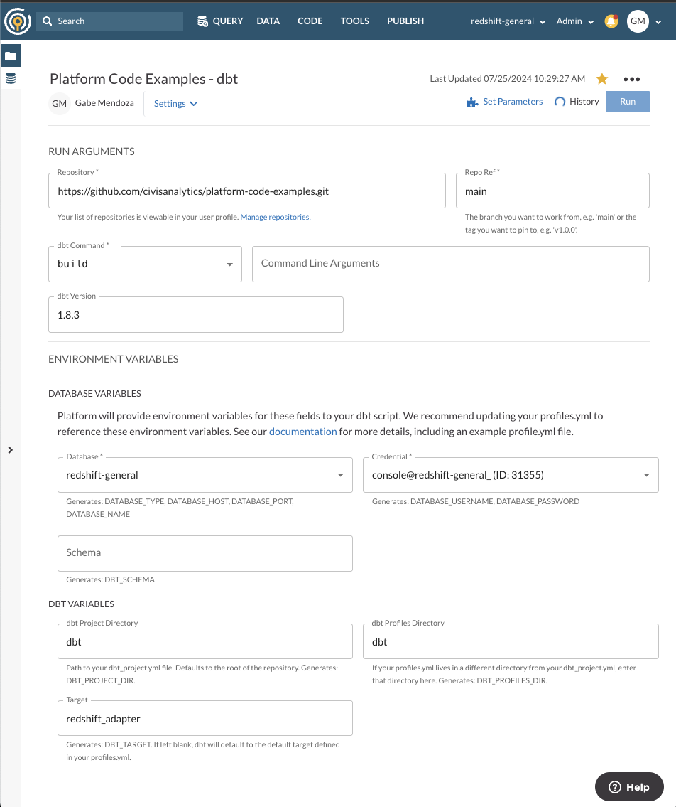

# dbt Examples

This directory contains the configuration files, models, and seeds for the dbt (Data Build Tool) project. The dbt project is used to transform raw data into a more usable format for analysis.

## Structure

- [`dbt_project.yml`](command:_github.copilot.openRelativePath?%5B%7B%22scheme%22%3A%22file%22%2C%22authority%22%3A%22%22%2C%22path%22%3A%22%2FUsers%2Fgmendoza%2Fsource%2Fcivis-dbt-docker%2Fplatform-code-examples%2Fdbt%2Fdbt_project.yml%22%2C%22query%22%3A%22%22%2C%22fragment%22%3A%22%22%7D%5D "/Users/gmendoza/source/civis-dbt-docker/platform-code-examples/dbt/dbt_project.yml"): Main configuration file for the dbt project.
- [`profiles.yml`](command:_github.copilot.openRelativePath?%5B%7B%22scheme%22%3A%22file%22%2C%22authority%22%3A%22%22%2C%22path%22%3A%22%2FUsers%2Fgmendoza%2Fsource%2Fcivis-dbt-docker%2Fplatform-code-examples%2Fdbt%2Fprofiles.yml%22%2C%22query%22%3A%22%22%2C%22fragment%22%3A%22%22%7D%5D "/Users/gmendoza/source/civis-dbt-docker/platform-code-examples/dbt/profiles.yml"): Profiles configuration for dbt, specifying different environments and their settings.
- `models/`: Directory containing SQL models for dbt.
  - `docs.md`: Documentation for the models.
  - [`overview.md`](command:_github.copilot.openRelativePath?%5B%7B%22scheme%22%3A%22file%22%2C%22authority%22%3A%22%22%2C%22path%22%3A%22%2FUsers%2Fgmendoza%2Fsource%2Fcivis-dbt-docker%2Fplatform-code-examples%2Fdbt%2Fmodels%2Foverview.md%22%2C%22query%22%3A%22%22%2C%22fragment%22%3A%22%22%7D%5D "/Users/gmendoza/source/civis-dbt-docker/platform-code-examples/dbt/models/overview.md"): Overview of the dbt project.
  - `schema.yml`: Schema configuration for the models.
  - `staging/`: Directory containing staging models.
    - `stg_customers.sql`: SQL model for staging customers.
    - `stg_orders.sql`: SQL model for staging orders.
    - `stg_payments.sql`: SQL model for staging payments.
- `seeds/`: Directory containing seed files for dbt.

## Configuration

### dbt_project.yml

The [`dbt_project.yml`](command:_github.copilot.openRelativePath?%5B%7B%22scheme%22%3A%22file%22%2C%22authority%22%3A%22%22%2C%22path%22%3A%22%2FUsers%2Fgmendoza%2Fsource%2Fcivis-dbt-docker%2Fplatform-code-examples%2Fdbt%2Fdbt_project.yml%22%2C%22query%22%3A%22%22%2C%22fragment%22%3A%22%22%7D%5D "/Users/gmendoza/source/civis-dbt-docker/platform-code-examples/dbt/dbt_project.yml") file contains the main configuration for the dbt project, including the project name, version, paths to models, seeds, and other configurations.

### profiles.yml

The [`profiles.yml`](command:_github.copilot.openRelativePath?%5B%7B%22scheme%22%3A%22file%22%2C%22authority%22%3A%22%22%2C%22path%22%3A%22%2FUsers%2Fgmendoza%2Fsource%2Fcivis-dbt-docker%2Fplatform-code-examples%2Fdbt%2Fprofiles.yml%22%2C%22query%22%3A%22%22%2C%22fragment%22%3A%22%22%7D%5D "/Users/gmendoza/source/civis-dbt-docker/platform-code-examples/dbt/profiles.yml") file contains the profiles configuration for dbt, specifying different environments (e.g., development, production) and their settings, such as database credentials and connection details.

## Platform Configuration

When using this example in Civis Platform, you will need to include `dbt` for both `dbt Project Directory` and `dbt Profiles Directory` as highlighted in the screenshot below.

When creating a dbt job with your own git repository, if `profiles.yml` and/or `dbt_project.yml` are located at the root of the repository, you can leave these blank.

## Environment Variables

Below is a quick reference of the environment variables used in the dbt example. For in depth documentation on the topic, please see the [dbt's environment variables documentation.](https://docs.getdbt.com/docs/build/environment-variables)

### Shared Environment Variables

The environment variables listed below can be used universally across all database types.

- `DATABASE_TYPE`: The database type.
- `DATABASE_NAME`: The name of the database, e.g. "dev"
- `DATABASE_SCHEMA`: The name of the schema on the database.

### PostgreSQL & Redshift

For PostgreSQL and Redshift connections, the following environment variables are required:

- `DBT_HOST`: The hostname of the database server.
- `DBT_PORT`: The port number on which the database server is listening.
- `DBT_USER`: The username to connect to the database.
- `DBT_PASSWORD`: The password to connect to the database.

### BigQuery

For BigQuery connections, the following environment variables are required depending on whether you are connecting via a service account json keyfile credentil or via an oauth credential

### Shared Environment Variables

- `GCP_AUTH_METHOD`: The BigQuery authentication method.
- `GCP_PROJECT_ID`: The Project ID of the Google Cloud Platform BigQuery Project
- `DBT_DATASET_NAME`: The name of the BigQuery Dataset

#### Service Accounts JSON Keyfile

- `GCP_SERVICE_ACCOUNT_KEYFILE_JSON`: The GCP Service Account JSON Credential Key File

#### OAuth Credentials - TODO

